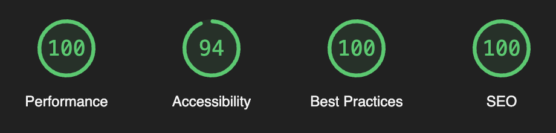
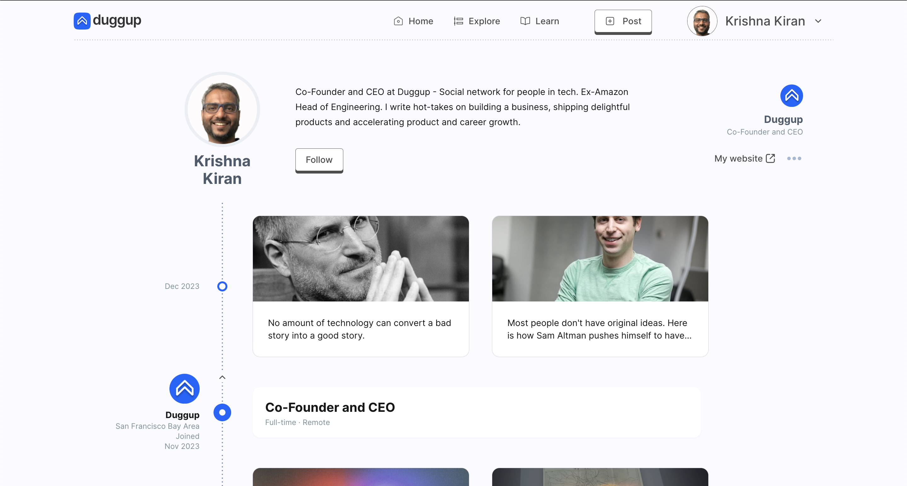
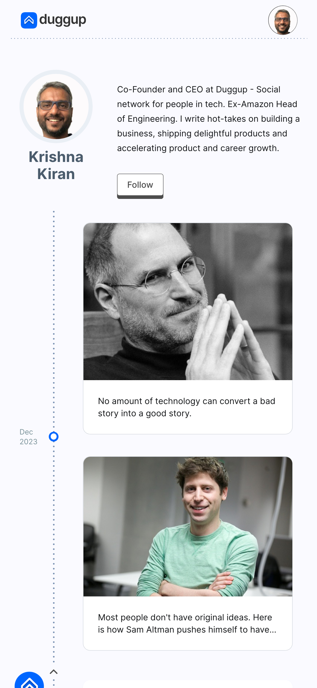

# Front-end Test for Duggup

Front-end assignment for Duggup - a no non-sense social media.
Developed in SvelteKit. Components from shadcn/ui.

[Live on Vercel](https://duggup-vynex.vercel.app/users/krishna-kiran)

---



---




---
### 💡 Running Locally

```bash
$ git clone git@github.com:Vynex/duggup.git

$ cd duggup
$ npm install

$ npm run dev -- --open
```
